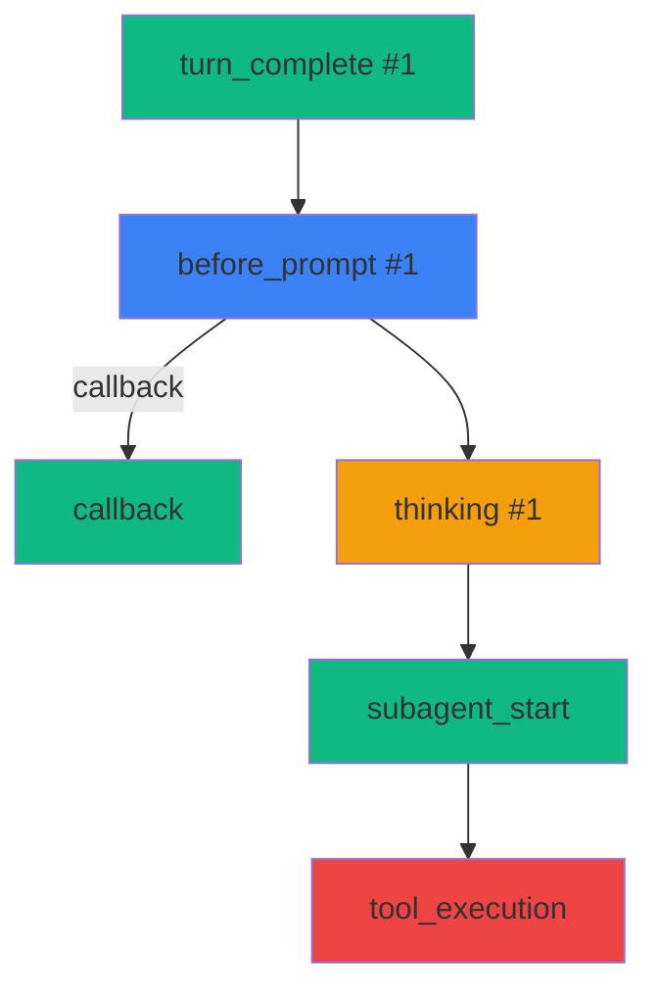

# Cycle 21 P0-2 SPEC: Hook 执行链路可视化

> **任务编号**: G21-02
> **严重程度**: P0 高
> **目标版本**: v6.49.0
> **创建日期**: 2026-07-29

---

## 一、任务目标

实现 `HookChainTracker` 引擎，为 HooksEngine 补充执行链路追踪能力，并构建 `HookChainViewer` UI 面板提供时间线/DAG/火焰图三种可视化模式。

## 二、需求规格

### 2.1 功能需求

| 编号 | 功能 | 描述 |
|------|------|------|
| FR-01 | 链路创建 | `startChain(event)` 创建新链路 |
| FR-02 | 节点添加 | `addNode(chainId, node)` 添加 hook 执行节点 |
| FR-03 | 节点状态 | 支持 pending/running/success/failed/timeout/cancelled |
| FR-04 | 嵌套支持 | `triggerChildHook()` 嵌套时自动关联父链 |
| FR-05 | 链路查询 | `getChains(filter)` 多条件查询 |
| FR-06 | 链路详情 | `getChain(chainId)` 获取完整链路数据 |
| FR-07 | 链路导出 | `exportChain(chainId, format)` 支持 JSON/Mermaid |
| FR-08 | 环形缓冲 | 最多保留 1000 条链路 |
| FR-09 | 时间线视图 | 横向条形图展示 hook 执行序列 |
| FR-10 | DAG 视图 | 节点 + 边 + 状态颜色编码 |
| FR-11 | 实时更新 | 新链路自动推送到 UI |
| FR-12 | 过滤 | 按类型/状态/时间过滤 |

### 2.2 非功能需求

| 编号 | 指标 | 目标值 |
|------|------|--------|
| NFR-01 | 单元测试覆盖率 | ≥ 80% |
| NFR-02 | TypeScript 错误 | 0 |
| NFR-03 | 链路添加延迟 | < 10ms |
| NFR-04 | 1000 条链路内存占用 | < 5MB |

## 三、接口设计

### 3.1 数据结构

```typescript
export interface HookChain {
  chainId: string;
  rootEvent: HookEvent;
  nodes: HookChainNode[];
  startTime: number;
  endTime?: number;
  totalDuration?: number;
  status: 'running' | 'success' | 'failed' | 'partial';
  triggerType: HookType;
  payload?: Record<string, unknown>;
}

export interface HookChainNode {
  nodeId: string;
  hookId: string;
  hookName: string;
  hookType: HookType;
  status: HookExecutionStatus;
  startTime: number;
  endTime?: number;
  duration?: number;
  parentNodeId?: string;
  triggeredByNodeId?: string;
  error?: string;
  result?: unknown;
  depth: number;
  priority: number;
}

export interface HookChainFilter {
  status?: HookChain['status'] | HookChain['status'][];
  triggerType?: HookType | HookType[];
  sinceMs?: number;
  untilMs?: number;
  limit?: number;
  sortBy?: 'startTime' | 'duration' | 'nodeCount';
  sortOrder?: 'asc' | 'desc';
}

export interface HookChainStats {
  totalChains: number;
  totalNodes: number;
  byStatus: Record<HookChain['status'], number>;
  byType: Record<HookType, number>;
  avgDuration: number;
  avgNodesPerChain: number;
  successRate: number;
}
```

### 3.2 核心方法

```typescript
export class HookChainTracker {
  startChain(event: HookEvent): HookChain;
  addNode(chainId: string, node: Omit<HookChainNode, 'nodeId' | 'startTime' | 'depth'>): HookChainNode;
  updateNode(chainId: string, nodeId: string, update: Partial<HookChainNode>): void;
  finishChain(chainId: string, status: HookChain['status']): void;
  getChain(chainId: string): HookChain | null;
  getChains(filter?: HookChainFilter): HookChain[];
  getStats(filter?: HookChainFilter): HookChainStats;
  exportChain(chainId: string, format: 'json' | 'mermaid' | 'dot'): string;
  clear(filter?: HookChainFilter): number;
  
  // 订阅
  on(type: ChainEventType, handler: ChainEventHandler): () => void;
  
  // 单例
  static getInstance(): HookChainTracker;
  static resetInstance(): void;
}
```

## 四、可视化方案

### 4.1 时间线视图

```html
0ms       100ms      200ms      300ms
├─ before_prompt #1 ─────────┤
│  └─ callback   ─────┤
├─ thinking #1      ───────────────┤
│  └─ subagent_start ──┤
│     └─ tool_execution ─────┤
└─ turn_complete #1 ─────┤
```

### 4.2 DAG 视图



### 4.3 火焰图

- 堆叠条形图
- 高度代表耗时
- 点击查看详情

## 五、验收标准

- ✅ HookChainTracker 引擎完整实现
- ✅ HookChainViewer UI 三种视图模式
- ✅ 单元测试覆盖 80%+ 场景
- ✅ App.tsx 集成 + ErrorBoundary
- ✅ 文档完整（中文注释 + 函数注释）

---

**SPEC 完成日期**: 2026-07-29
**负责人**: Hermes AI Agent
