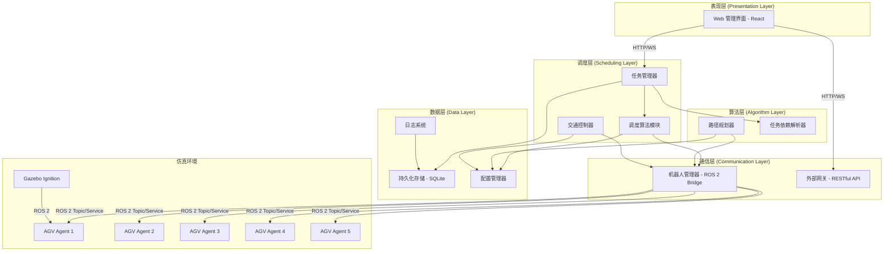

# 架构设计文档 (spec.md)

## 1. 模块视图

系统采用分层架构，分为五层，各层职责清晰，模块间通过定义良好的接口通信。

```mermaid
graph TD
    subgraph "表现层 (Presentation Layer)"
        WebUI[Web 管理界面 - React]
    end

    subgraph "调度层 (Scheduling Layer)"
        TM[任务管理器]
        SA[调度算法模块]
        TC[交通控制器]
    end

    subgraph "算法层 (Algorithm Layer)"
        PP[路径规划器]
        TD[任务依赖解析器]
    end

    subgraph "通信层 (Communication Layer)"
        RM[机器人管理器 - ROS 2 Bridge]
        EG[外部网关 - RESTful API]
    end

    subgraph "数据层 (Data Layer)"
        DB[持久化存储 - SQLite]
        LOG[日志系统]
        CFG[配置管理器]
    end

    subgraph "仿真环境"
        GAZEBO[Gazebo Ignition]
        AGV1[AGV Agent 1]
        AGV2[AGV Agent 2]
        AGV3[AGV Agent 3]
        AGV4[AGV Agent 4]
        AGV5[AGV Agent 5]
    end

    WebUI -->|HTTP/WS| EG
    WebUI -->|HTTP/WS| TM
    TM --> SA
    TM --> TD
    SA --> RM
    PP --> RM
    TC --> RM
    RM -->|ROS 2 Topic/Service| AGV1
    RM -->|ROS 2 Topic/Service| AGV2
    RM -->|ROS 2 Topic/Service| AGV3
    RM -->|ROS 2 Topic/Service| AGV4
    RM -->|ROS 2 Topic/Service| AGV5
    GAZEBO -->|ROS 2| AGV1
    TM --> DB
    SA --> CFG
    PP --> CFG
    TC --> CFG
    LOG --> DB
```

### 1.1 模块职责

| 层 | 模块 | 职责 |
| :