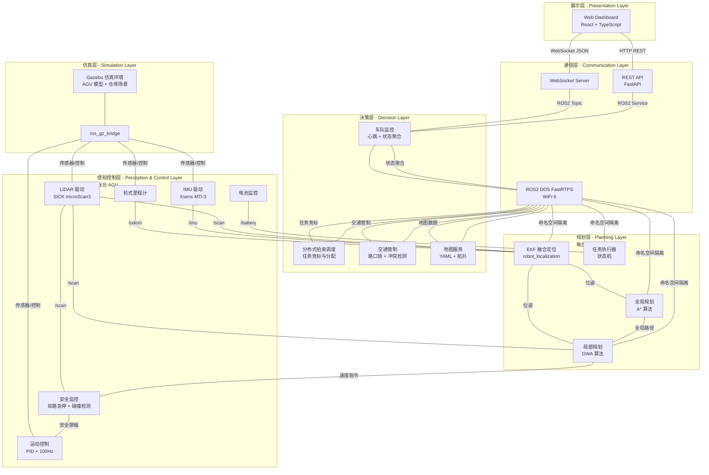
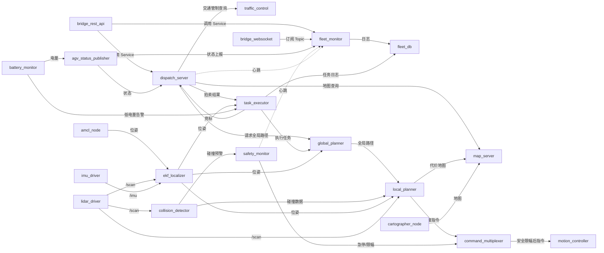

# AGV 仓储调度系统 — 架构总览文档

> **文档版本**: v1.0
> **基线需求**: requirements_v1.0.md (2026-07-02)
> **创建日期**: 2026-07-02
> **状态**: 初版
> **编制**: 总架构师智能体

---

## 目录

1. [系统设计总纲](#1-系统设计总纲)
2. [分层架构总览](#2-分层架构总览)
3. [模块划分与分层映射](#3-模块划分与分层映射)
4. [模块间依赖关系](#4-模块间依赖关系)
5. [系统级数据流总览](#5-系统级数据流总览)
6. [关键设计决策](#6-关键设计决策)
7. [架构原则与约束](#7-架构原则与约束)

---

## 1. 系统设计总纲

### 1.1 设计哲学

本系统采用 **混合式架构**：任务调度采用 **分布式拍卖机制**（去中心化决策），交通管制与状态监控采用 **集中式协调**（中心服务器仲裁）。核心设计原则如下：

| 原则 | 说明 |
|------|------|
| **去中心化任务决策** | 每台 AGV 根据自身状态（电量、位置、负载）自主竞标任务，避免单点故障 |
| **安全第一** | 安全层独立于业务层，SIL2 双通道急停不依赖任何软件逻辑 |
| **实时闭环** | 控制回路 100Hz / 传感器融合 50Hz / 路径规划 <= 50ms |
| **接口标准化** | 所有模块间通信通过 ROS2 标准消息类型，最小化自定义消息 |
| **仿真优先** | 全系统先在 Gazebo 仿真验证，再迁移至真机 |

### 1.2 技术栈选型

| 层次 | 技术选型 | 版本 |
|------|----------|------|
| 操作系统 | Ubuntu | 22.04 LTS |
| 机器人中间件 | ROS2 Humble Hawksbill | Humble |
| DDS 中间件 | FastRTPS | Humble 默认 |
| SLAM 框架 | Cartographer ROS2 | ROS2 Humble 适配版 |
| 全局规划 | A* 算法 | 自定义实现 |
| 局部规划 | DWA (Dynamic Window Approach) | 自定义实现 |
| 传感器融合 | robot_localization (EKF) | Humble 发行版 |
| 仿真环境 | Gazebo | Ubuntu 22.04 版 |
| 前端框架 | React + TypeScript | 最新 LTS |
| 后端框架 | FastAPI (Python) | 3.10+ |
| 可视化通信 | WebSocket + JSON | - |
| 持久化 | SQLite | 3.x |

### 1.3 硬件参数映射

| 需求参数 | 值 | 架构影响 |
|----------|-----|----------|
| 驱动方式 | 双轮差速驱动 | 运动学模型为差速模型，支持原地旋转 |
| 最大线速度 | 1.5 m/s | 影响安全距离、DWA 速度窗口、限幅器阈值 |
| 最大角速度 | 1.0 rad/s | 影响转弯半径、DWA 角速度窗口 |
| 额定负载 | 500 kg | 影响运动控制 PID 参数、制动距离 |
| LiDAR | SICK microScan3 | 自定义驱动节点，Ethernet 接口 |
| IMU | Xsens MTi-3 | ROS2 标准 IMU 驱动，100Hz 输出 |

---

## 2. 分层架构总览

### 2.1 五层架构图



### 2.2 分层职责表

| 层编号 | 层级名称 | 职责 | 关键技术 | 部署位置 | 编程语言 | 实时性要求 |
|--------|----------|------|----------|----------|----------|------------|
| L1 | **展示层** | Web 可视化监控、任务管理界面 | React, WebSocket, Canvas/Leaflet | 中心服务器/浏览器 | TypeScript | 非实时 (20Hz 刷新) |
| L2 | **通信层** | REST API 网关、WebSocket 推送、DDS 通信 | FastAPI, ROS2, FastRTPS | 中心服务器 | Python, C++ | 软实时 |
| L3 | **决策层** | 分布式拍卖调度、交通管制、车队监控、地图服务 | ROS2, Action/Service, SQLite | 中心服务器 | C++, Python | 软实时 (100Hz 调度) |
| L4 | **规划层** | 全局路径规划 (A*)、局部避障 (DWA)、EKF 融合定位、任务执行 | ROS2, A*, DWA, EKF | 每台 AGV 车载计算机 | C++ | 硬实时 (50ms) |
| L5 | **感知控制层** | LiDAR/IMU 驱动、碰撞检测、双路急停、运动控制、电池监控 | ROS2, PID, GPIO | 每台 AGV 车载计算机 | C++ | 硬实时 (10ms) |
| L6 | **仿真层** | Gazebo 仿真环境、传感器模拟 | Gazebo, URDF, ros_gz_bridge | 仿真工作站 | C++, Python | N/A |

### 2.3 部署架构

```mermaid
graph TB
    subgraph 中心服务器[中心服务器 - Central Server]
        direction TB
        DISPATCH[dispatch_server<br/>C++ Node]
        TRAFFIC[traffic_control<br/>C++ Node]
        MONITOR[fleet_monitor<br/>Python Node]
        MAP_SRV2[map_server<br/>C++ Node]
        API[bridge_rest_api<br/>Python FastAPI]
        WS2[bridge_websocket<br/>Python]
        DB[fleet_db<br/>Python SQLite]
    end

    subgraph WiFi6[WiFi 6 局域网 - DDS FastRTPS]
        DDS2[ROS2 DDS<br/>心跳 50ms / 断连 200ms 停车]
    end

    subgraph AGV1[AGV 01 - 车载计算机]
        NAV1[导航规划节点<br/>global_planner + local_planner]
        EKF1[定位融合<br/>ekf_localizer]
        SAFE1[安全节点<br/>safety_monitor]
        CTRL1[运动控制<br/>motion_controller]
        EXEC1[任务执行<br/>task_executor]
    end

    subgraph AGV2[AGV 02 - 车载计算机]
        NAV2[导航规划节点]
        EKF2[定位融合]
        SAFE2[安全节点]
        CTRL2[运动控制]
        EXEC2[任务执行]
    end

    subgraph AGVN[AGV 03-05 - 车载计算机]
        NAVN[导航规划节点]
        EKFN[定位融合]
        SAFEN[安全节点]
        CTRLN[运动控制]
        EXECN[任务执行]
    end

    subgraph Browser[浏览器]
        WEB2[Web Dashboard]
    end

    WEB2 -->|HTTP REST| API
    WEB2 -->|WebSocket JSON| WS2
    API --> DISPATCH
    WS2 --> MONITOR

    DISPATCH --> DDS2
    TRAFFIC --> DDS2
    MONITOR --> DDS2
    MAP_SRV2 --> DDS2

    DDS2 -->|/agv_01/*| NAV1
    DDS2 -->|/agv_01/*| EKF1
    DDS2 -->|/agv_01/*| SAFE1
    DDS2 -->|/agv_01/*| CTRL1
    DDS2 -->|/agv_01/*| EXEC1

    DDS2 -->|/agv_02/*| NAV2
    DDS2 -->|/agv_02/*| EKF2
    DDS2 -->|/agv_02/*| SAFE2
    DDS2 -->|/agv_02/*| CTRL2
    DDS2 -->|/agv_02/*| EXEC2

    DDS2 -->|/agv_0[3-5]/*| NAVN
    DDS2 -->|/agv_0[3-5]/*| EKFN
    DDS2 -->|/agv_0[3-5]/*| SAFEN
    DDS2 -->|/agv_0[3-5]/*| CTRLN
    DDS2 -->|/agv_0[3-5]/*| EXECN
```

### 2.4 命名空间约定

| 类别 | 格式 | 示例 |
|------|------|------|
| 车队级 Topic | `/fleet/<domain>/<topic>` | `/fleet/dispatch/auction_bid` |
| 单车 Topic | `/agv_<id>/<domain>/<topic>` | `/agv_01/navigation/cmd_vel_raw` |
| 车队级 Service | `/fleet/<domain>/<service>` | `/fleet/dispatch/register_agv` |
| 单车 Service | `/agv_<id>/<domain>/<service>` | `/agv_01/safety/reset_emergency` |
| 车队级 Action | `/fleet/<domain>/<action>` | `/fleet/dispatch/execute_task` |
| 单车 Action | `/agv_<id>/<domain>/<action>` | `/agv_01/navigation/navigate` |
| 参数 | `<node>.<param>` | `safety_monitor.front_zone_distance` |
| 坐标系 | `map`, `odom`, `base_footprint`, `base_laser`, `base_imu` | 遵循 REP 105 |
| AGV ID | `agv_01` ~ `agv_05` | 3-5 台 AGV |

---

## 3. 模块划分与分层映射

### 3.1 10 个功能模块到各层的映射

| 功能模块 | 所属层级 | 对应节点 | 说明 |
|----------|----------|----------|------|
| F-1: 分布式拍卖任务调度 | L3 决策层 | `dispatch_server`, `task_executor` (AGV 端) | 去中心化：AGV 自主竞标，中心仅做拍卖结果仲裁 |
| F-2: A* 全局路径规划 | L4 规划层 | `global_planner` | 每台 AGV 独立规划，中心地图服务提供代价地图 |
| F-3: DWA 局部避障 | L4 规划层 | `local_planner` | 每台 AGV 独立运行，实时动态避障 |
| F-4: EKF 多传感器融合定位 | L4 规划层 | `ekf_localizer` | 基于 robot_localization 包 |
| F-5: AMCL + Cartographer SLAM | L4 规划层 | `cartographer_node`, `amcl_node` | Cartographer 建图模式，AMCL 定位模式 |
| F-6: 双路急停 + 双重碰撞检测 | L5 感知控制层 | `safety_monitor`, `collision_detector` | 安全层独立于业务层 |
| F-7: Web 可视化 | L1 展示层 | Web Dashboard | React 前端，WebSocket 通信 |
| F-8: REST API | L2 通信层 | `bridge_rest_api` | FastAPI 实现 |
| F-9: 故障恢复 | L3 决策层 + L5 安全层 | `fleet_monitor`, `safety_monitor` | 分布式故障检测与恢复链路 |
| F-10: ROS2 DDS FastRTPS over WiFi 6 | L2 通信层 | DDS 基础设施 | QoS 配置、心跳机制 |

### 3.2 模块清单总表

| 编号 | 模块名称 | 进程类型 | 运行位置 | 语言 | 实时性 |
|------|----------|----------|----------|------|--------|
| M1 | `dispatch_server` | ROS2 Node (独立进程) | 中心服务器 | C++ | 软实时 (100Hz) |
| M2 | `traffic_control` | ROS2 Node (独立进程) | 中心服务器 | C++ | 软实时 (100Hz) |
| M3 | `fleet_monitor` | ROS2 Node (独立进程) | 中心服务器 | Python | 非实时 (10Hz) |
| M4 | `map_server` | ROS2 Node (独立进程) | 中心服务器 | C++ | 非实时 |
| M5 | `bridge_rest_api` | 独立进程 (FastAPI) | 中心服务器 | Python | 非实时 |
| M6 | `bridge_websocket` | 独立进程 (WebSocket) | 中心服务器 | Python | 非实时 |
| M7 | `fleet_db` | ROS2 Node (独立进程) | 中心服务器 | Python | 非实时 |
| M8 | `global_planner` | ROS2 Node (单车) | AGV 车载计算机 | C++ | 软实时 (<= 50ms) |
| M9 | `local_planner` | ROS2 Node (单车) | AGV 车载计算机 | C++ | 硬实时 (100Hz) |
| M10 | `ekf_localizer` | ROS2 Node (单车) | AGV 车载计算机 | C++ | 硬实时 (50Hz) |
| M11 | `cartographer_node` | ROS2 Node (单车) | AGV 车载计算机 | C++ | 软实时 (建图模式) |
| M12 | `amcl_node` | ROS2 Node (单车) | AGV 车载计算机 | C++ | 软实时 (20Hz) |
| M13 | `safety_monitor` | ROS2 Node (单车) | AGV 车载计算机 | C++ | 硬实时 (<= 10ms) |
| M14 | `collision_detector` | ROS2 Node (单车) | AGV 车载计算机 | C++ | 硬实时 (100Hz) |
| M15 | `motion_controller` | ROS2 Node (单车) | AGV 车载计算机 | C++ | 硬实时 (100Hz) |
| M16 | `command_multiplexer` | ROS2 Node (单车) | AGV 车载计算机 | C++ | 硬实时 (100Hz) |
| M17 | `task_executor` | ROS2 Node (单车) | AGV 车载计算机 | C++ | 非实时 |
| M18 | `agv_status_publisher` | ROS2 Node (单车) | AGV 车载计算机 | C++ | 非实时 (10Hz) |
| M19 | `lidar_driver` | ROS2 Node (单车) | AGV 车载计算机 | C++ | 硬实时 |
| M20 | `imu_driver` | ROS2 Node (单车) | AGV 车载计算机 | C++ | 硬实时 (100Hz) |
| M21 | `battery_monitor` | ROS2 Node (单车) | AGV 车载计算机 | C++ | 非实时 (1Hz) |
| M22 | Web Dashboard | 浏览器应用 | 浏览器 / 服务器 | TypeScript | 非实时 |

---

## 4. 模块间依赖关系

### 4.1 依赖关系图



### 4.2 模块依赖矩阵

| 模块 | 依赖模块 | 依赖类型 | 说明 |
|------|----------|----------|------|
| dispatch_server | map_server, traffic_control | Service 调用 | 获取地图拓扑和交通状态 |
| global_planner | map_server | Service 调用 | 获取代价地图 |
| local_planner | global_planner, collision_detector, ekf_localizer | Topic 订阅 | 需要全局路径、障碍物、位姿 |
| ekf_localizer | lidar_driver, imu_driver | Topic 订阅 | 需要 LiDAR scan 和 IMU 数据 |
| safety_monitor | collision_detector | Topic 订阅 | 需要碰撞检测结果 |
| command_multiplexer | local_planner, safety_monitor | Topic 订阅 | 速度指令仲裁 |
| task_executor | dispatch_server | Action 调用 | 接收任务指令 |
| fleet_monitor | 所有 AGV status | Topic 订阅 | 状态聚合 |
| bridge_rest_api | dispatch_server, fleet_monitor | Service 调用 | 对外接口 |

---

## 5. 系统级数据流总览

### 5.1 三大数据流

| 数据流 | 源 | 目标 | 实时性要求 | 安全关键 |
|--------|-----|------|------------|----------|
| 传感器数据流 | LiDAR, IMU, 编码器 | EKF -> 规划 -> 控制 | 硬实时 (<= 10ms) | 是 |
| 任务数据流 | REST API / WMS | 拍卖 -> 执行 -> 反馈 | 软实时 (<= 500ms) | 否 |
| 状态数据流 | AGV 状态发布 | Web 可视化 | 非实时 (100ms) | 否 |

### 5.2 数据流带宽预算

| 数据流 | 消息大小 | 频率 | 单 AGV 带宽 | 5 AGV 总带宽 |
|--------|----------|------|-------------|--------------|
| LiDAR /scan | ~4 KB | 15 Hz | 60 KB/s | 300 KB/s |
| IMU /imu | ~200 B | 100 Hz | 20 KB/s | 100 KB/s |
| Odometry /odom | ~200 B | 50 Hz | 10 KB/s | 50 KB/s |
| EKF 位姿 /ekf/odom | ~200 B | 50 Hz | 10 KB/s | 50 KB/s |
| TF /tf | ~200 B | 50 Hz | 10 KB/s | 50 KB/s |
| 控制指令 cmd_vel | ~100 B | 100 Hz | 10 KB/s | 50 KB/s |
| 状态 /status | ~200 B | 10 Hz | 2 KB/s | 10 KB/s |
| 拍卖消息 (事件) | ~500 B | 事件 | < 1 KB/s | < 5 KB/s |
| 全局路径 (事件) | ~10 KB | 事件 | < 1 KB/s | < 5 KB/s |
| **总计** | | | **~123 KB/s/AGV** | **~620 KB/s** |

WiFi 6 理论带宽 >= 600 Mbps，实际可用 >= 100 Mbps，带宽充足。

---

## 6. 关键设计决策

### 6.1 分布式拍卖 vs 集中式调度

| 对比项 | 分布式拍卖（本架构选用） | 集中式调度（v3.0 方案） |
|--------|------------------------|------------------------|
| 决策中心 | 每台 AGV 自主竞标，中心仅仲裁 | 中心服务器统一分配 |
| 单点故障 | 无单点故障（拍卖可降级） | 调度器故障则全系统瘫痪 |
| 可扩展性 | 新增 AGV 无需修改中心逻辑 | 新增 AGV 需更新调度算法 |
| 决策延迟 | 多轮竞标可能增加延迟 | 直接分配，延迟最低 |
| 负载均衡 | 自然均衡（AGV 自行评估） | 需要主动计算 |
| 复杂度 | 需要竞标协议和冲突消解 | 逻辑简单直接 |

**决策理由**：需求文档 F-1 明确要求"AGV 自主投标、竞标、任务认领"，因此采用分布式拍卖机制。中心服务器的 `dispatch_server` 仅作为拍卖协调者和结果仲裁者，不直接分配任务。

### 6.2 安全层独立性

安全层（`safety_monitor` + `collision_detector`）与业务层（`local_planner`、`task_executor`）完全解耦，遵循以下隔离原则：

1. **数据流隔离**：`collision_detector` 直接订阅 LiDAR `/scan`，不经过业务层
2. **控制流隔离**：`safety_monitor` 在 `command_multiplexer` 中拥有最高优先级，可覆盖任何速度指令
3. **硬件隔离**：硬件急停通道不经过任何软件逻辑，直接切断电机电源
4. **进程隔离**：安全节点独立进程，崩溃不影响业务层（但业务层崩溃不影响安全层）

### 6.3 Cartographer SLAM + AMCL 双模式

| 模式 | 激活条件 | 使用算法 | 输出 |
|------|----------|----------|------|
| **建图模式** | 首次部署 / 地图更新请求 | Cartographer SLAM | 构建/更新栅格地图 |
| **定位模式** | 已有地图的日常运行 | AMCL + EKF 辅助 | 全局位姿估计 |

两者通过生命周期节点（Lifecycle Node）管理状态切换，切换时自动保存/加载地图。

### 6.4 命名空间隔离策略

- 中心服务器节点使用无命名空间话题（`/fleet/*`）
- 每台 AGV 的节点使用命名空间隔离（`/agv_<id>/*`）
- 启动时通过 `ros2 launch` 的 `namespace` 参数自动注入 AGV ID
- 同一台 AGV 的节点共享同一命名空间，Topic 名相对路径

---

## 7. 架构原则与约束

### 7.1 实时性约束

| 约束 | 目标值 | 违反后果 |
|------|--------|----------|
| 控制回路周期 | 100 Hz (10ms) | 运动控制不稳定 |
| 传感器融合输出 | 50 Hz (20ms) | 定位延迟增大 |
| 路径规划延迟 | <= 50ms | 任务等待超时 |
| 端到端延迟 | <= 50ms (P99) | 安全风险 |
| 避障响应 | <= 50ms | 碰撞风险 |
| 急停响应 | <= 10ms | 严重安全事故 |

### 7.2 安全约束

| 约束 | 要求 | 实现方式 |
|------|------|----------|
| SIL2 | IEC 61508 参照 | 双通道急停、冗余碰撞检测、三层限幅 |
| 硬件急停 | 不经过软件 | GPIO -> 继电器 -> 电机电源切断 |
| 软件急停 | <= 10ms | Safety Node 硬实时 C++ 实现 |
| 碰撞制动阈值 | 0.3m | LiDAR 物理检测 + 软件预测双重校验 |
| 通信超时停车 | 200ms | 心跳检测 + 安全停车 |
| 安全代码约束 | C++ 实现 | 禁止 Python GC 不确定性 |

### 7.3 性能约束

| 约束 | 目标值 |
|------|--------|
| 系统可用性 | >= 99.9% |
| 任务完成率 | >= 99% (1000 任务) |
| 故障接管时间 | <= 500ms |
| 24h 仿真稳定性 | 零碰撞、零死锁 |

---

## 附录 A: 术语表

| 术语 | 含义 |
|------|------|
| AGV | Automated Guided Vehicle，自动导引车，差速驱动模型 |
| DDS | Data Distribution Service，数据分发服务 |
| DWA | Dynamic Window Approach，动态窗口法 |
| EKF | Extended Kalman Filter，扩展卡尔曼滤波 |
| AMCL | Adaptive Monte Carlo Localization，自适应蒙特卡洛定位 |
| SLAM | Simultaneous Localization and Mapping，同步定位与建图 |
| SIL | Safety Integrity Level，安全完整性等级 |
| SLC | Safety Logic Controller，安全逻辑控制器 |
| QoS | Quality of Service，服务质量（ROS2 通信策略） |
| FastRTPS | Fast Real-Time Publish-Subscribe，DDS 实现 |

## 附录 B: 需求基线版本对照

| 需求版本 | 说明 |
|----------|------|
| requirements_v1.0.md | 初始需求基线（10 功能模块 + 非功能 + 约束 + 安全红线） |
| 本架构文档 | 基于 requirements_v1.0.md 的架构设计 |
